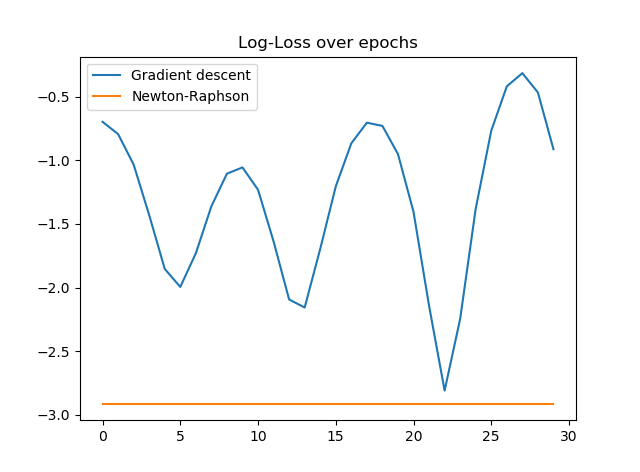
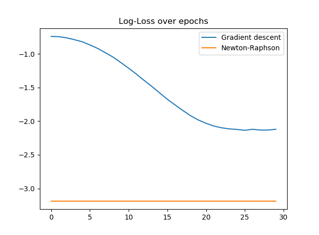
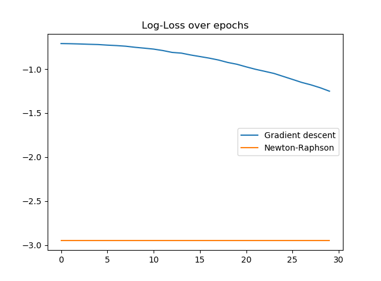

# The-failure-of-gradient-descent
Playing around with gradient descent and its limits.

## Context
Following Ali Rahimi's talk at NIPS 2017 (https://www.youtube.com/watch?v=Qi1Yry33TQE), I decided to explore the limits of gradient descent (GD) on **ill-conditioned problems**.

## Use case
I take the same use case that he mentions: a simple **one hidden layer neural network, with no non-linearities**. This is equivalent to two consecutive matrix multiplications.

Data is generated randomly. There are 600 datapoints, each of dimension 13. Labels are in dimension 4. The (13,4) matrix (named A in the code) mapping datapoints to labels that we are trying to learn is also generated randomly, with a Gaussian distribution. 

## How to do it
The trick here to play on singular values is to write A in its singular value decomposition: 

where D is diagonal with Gaussian values, U and V are orthogonal. Generating U and V can be done by taking the first matrix in the QR decomposition of 2 random matrices. 

A parameter named "ev" controls the weight that we add to the first singular value of this matrix (we add "ev" to the first element of D). This weight represents the ill-condition of the problem. A heavy such weigth will lead to GD needing a smaller and smaller learning rate to converge, if it converges at all. 

## What we do here
I compare here GD versus Newton's method, with **3 different ways to do backpropagation**:\
_**manually** (this is a great exercise)\
_with **Pytorch**\
_with **Tensorflow**

The 3 scripts are respectively np_manual.py, pytorch.py and tensorf.py. 

I compare GD with Newton Raphson's method. Since dimension is not too large here, the Hessian can easily be calculated and inversed. 

## Some results
Let's take an example with Pytorch and an "ev" value of 1, which is the order of magnitude of the condition number of A (in this case A will typically have a condition number of 3 or 4). That is still quite small. 
The largest order of magnitude to the learning rate not leading to a divergence of gradient descent is :

Now gradient descent with :

and :

Setting the condition number via "ev" to a much higher value will lead gradient needing a smaller and smaller learning rate in order not to diverge. 

For instance, let's now set "ev" to 10000. 
